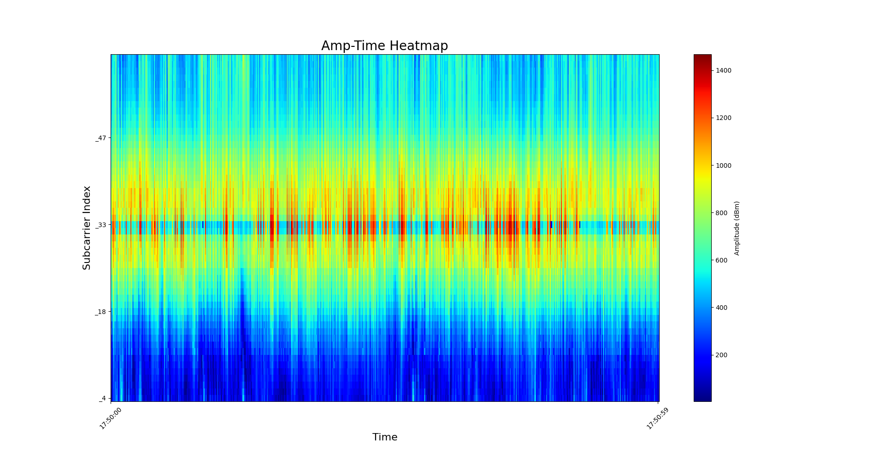
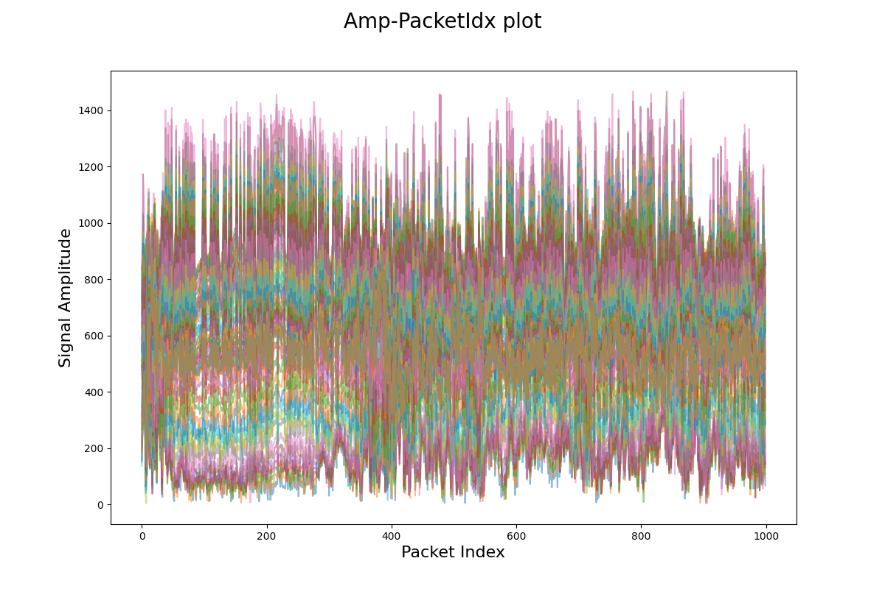
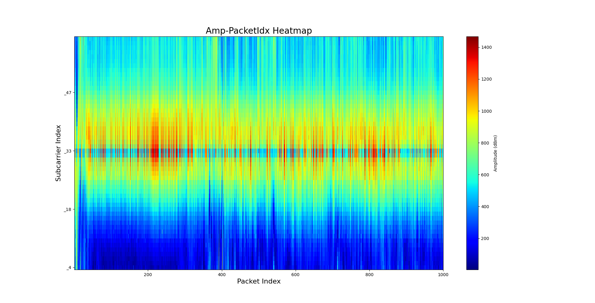
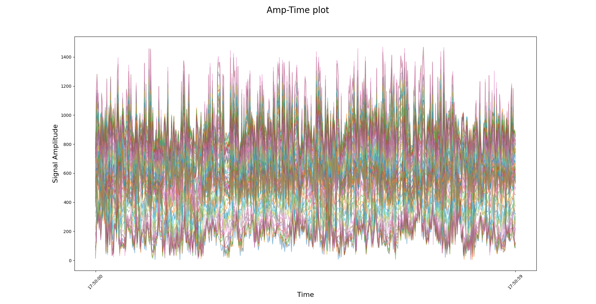
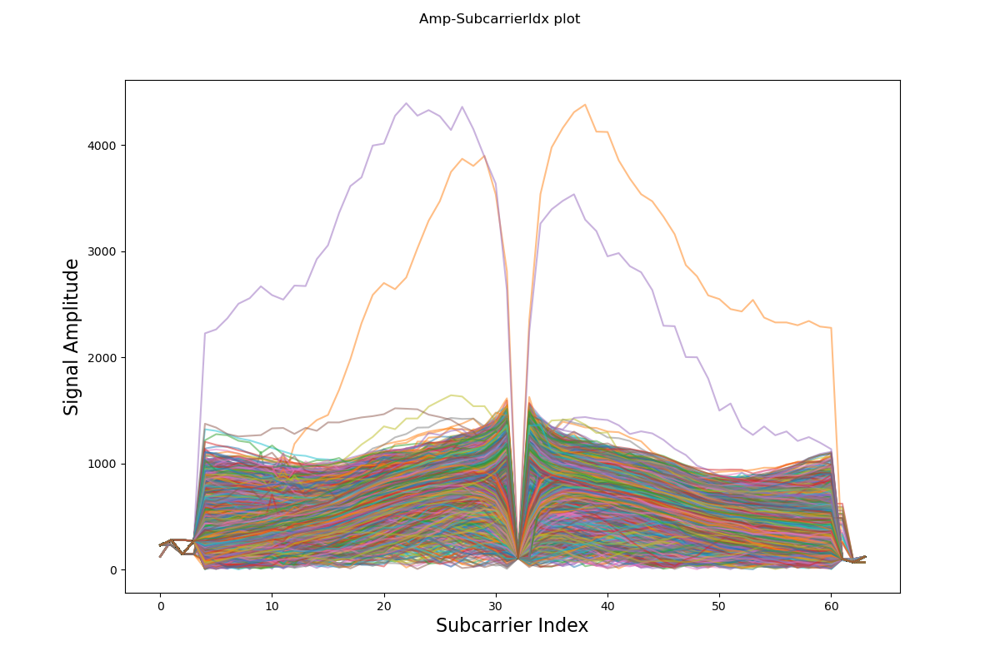

# CSI Data Visualization

This document explains common visualization techniques for WiFi CSI data and how to interpret them.

## Common CSI Visualizations

### 1. Amplitude-Time Heatmap



**Axes:**
- **X-axis**: Time (packets received over time)
- **Y-axis**: Subcarrier Index (e.g., 0-64 subcarriers)
- **Color**: Amplitude (signal strength)
  - Blue = weak signal
  - Green/Yellow = medium signal
  - Red = strong signal

**What it shows:**
- How each subcarrier's amplitude changes over time
- Temporal patterns in the wireless channel

**Key patterns:**
- **Horizontal bands**: Subcarriers with consistent amplitude
- **Vertical changes**: Environmental events (person moving, door opening, etc.)
- **Red/dark red spikes**: Strong signal events on specific subcarriers

**Use case:**
- Identifying when environmental changes occur
- Detecting human presence/movement over time

---

### 2. Amplitude-Packet Index Plot



**Axes:**
- **X-axis**: Packet number (sequential index)
- **Y-axis**: Signal Amplitude
- **Multiple overlaid lines**: Each line represents a different subcarrier

**What it shows:**
- Amplitude variation across packets for all subcarriers simultaneously
- Overall signal variability and noise level

**Key patterns:**
- High variability suggests dynamic environment
- Clusters of lines show groups of subcarriers with similar behavior
- Amplitude range typically 0-1400 (device dependent)

**Use case:**
- Quick overview of signal stability
- Identifying outlier packets

---

### 3. Amplitude-Packet Index Heatmap



**Axes:**
- **X-axis**: Packet Index (discrete packet numbers)
- **Y-axis**: Subcarrier Index
- **Color**: Amplitude

**What it shows:**
- Same information as Amp-Time Heatmap but indexed by packet number
- Easier to correlate with packet-level events

**Differences from Amp-Time Heatmap:**
- Packets are evenly spaced (time-based may have irregular intervals)
- Better for analyzing packet-by-packet changes

**Use case:**
- Debugging packet reception issues
- Training data preparation (packet-aligned features)

---

### 4. Amplitude-Time Plot (All Subcarriers)



**Axes:**
- **X-axis**: Time (timestamp)
- **Y-axis**: Signal Amplitude
- **Multiple overlaid lines**: Each subcarrier as separate line

**What it shows:**
- Real-time amplitude variation across all subcarriers
- Temporal dynamics of the wireless channel

**Key patterns:**
- Similar to Amp-Packet Index plot but time-aligned
- Shows periodic patterns if they exist

**Use case:**
- Real-time monitoring
- Identifying periodic events (e.g., fan rotation, breathing)

---

### 5. Amplitude-Subcarrier Index Plot (Multiple Packets)


**Axes:**
- **X-axis**: Subcarrier Index (0-64)
- **Y-axis**: Signal Amplitude
- **Multiple overlaid lines**: Each line is one packet (1000+ packets shown)

**What it shows:**
- Typical amplitude "shape" across frequency bands
- How signal strength varies across different frequencies

**Key observations:**
- **Subcarriers 0-5 and 60-64**: Low signal (guard bands to prevent interference)
- **Subcarriers 20-40**: Highest amplitude (best channels)
- **Prominent peaks**: Often pilot subcarriers used for synchronization
- **Dip around subcarrier 32**: DC null (center frequency)

**Use case:**
- Understanding frequency-domain characteristics
- Identifying which subcarriers are most informative

---

### 6. Amplitude-Subcarrier Index Plot (Single Packet)



**Axes:**
- **X-axis**: Subcarrier Index (0-64)
- **Y-axis**: Signal Amplitude
- **Single line**: One packet's CSI data

**What it shows:**
- Amplitude profile for a single CSI snapshot
- This represents ONE row of your (114, 10) tensor

**Key features:**
- Shows the frequency-selective fading pattern
- Bell-shaped curve with dip at center (DC null)
- Edge subcarriers have minimal signal (guard bands)

**Use case:**
- Understanding individual CSI samples
- Feature extraction for ML models
- Debugging data collection

---

## How Visualizations Help Detect Human Presence

### Empty Room
- **Heatmaps**: Consistent, stable color patterns over time
- **Time plots**: Low variability, steady amplitude
- **Subcarrier plots**: Consistent shape across packets

### Person Present
- **Heatmaps**: Color pattern changes, new vertical features
- **Time plots**: Increased amplitude variation
- **Subcarrier plots**: Shape distortion, different peaks

### Person Moving
- **Heatmaps**: Dynamic color changes, vertical streaks
- **Time plots**: Rapid amplitude fluctuations
- **Subcarrier plots**: Widely varying shapes

---

## Visualization Tools

From [csi-visualization](https://github.com/cheeseBG/csi-visualization) repository:

```python
# Example: Creating amplitude-time heatmap
import matplotlib.pyplot as plt
import numpy as np

# Assuming csi_data has shape (num_packets, num_subcarriers)
# and contains amplitude values

plt.figure(figsize=(12, 6))
plt.imshow(csi_data.T, aspect='auto', cmap='jet', origin='lower')
plt.xlabel('Packet Index')
plt.ylabel('Subcarrier Index')
plt.title('Amp-PacketIdx Heatmap')
plt.colorbar(label='Amplitude (dBm)')
plt.show()
```

---

## Choosing the Right Visualization

| Goal | Best Visualization |
|------|-------------------|
| Detect presence events | Amp-Time Heatmap |
| Analyze signal stability | Amp-Packet Index Plot |
| Understand frequency response | Amp-Subcarrier Index Plot |
| Debug data collection | Single Packet Subcarrier Plot |
| Real-time monitoring | Amp-Time Plot |
| Training data inspection | Amp-Packet Index Heatmap |

---

## For Your Project

When building your autoencoder for human presence detection:

1. **Start with**: Amp-Time Heatmap to visually identify empty vs occupied patterns
2. **Verify data quality**: Single Packet Subcarrier Plot to ensure all subcarriers are active
3. **Monitor training**: Amp-Packet Index Heatmap to see reconstruction quality
4. **Real-time deployment**: Use simple time-series plots for live detection feedback
